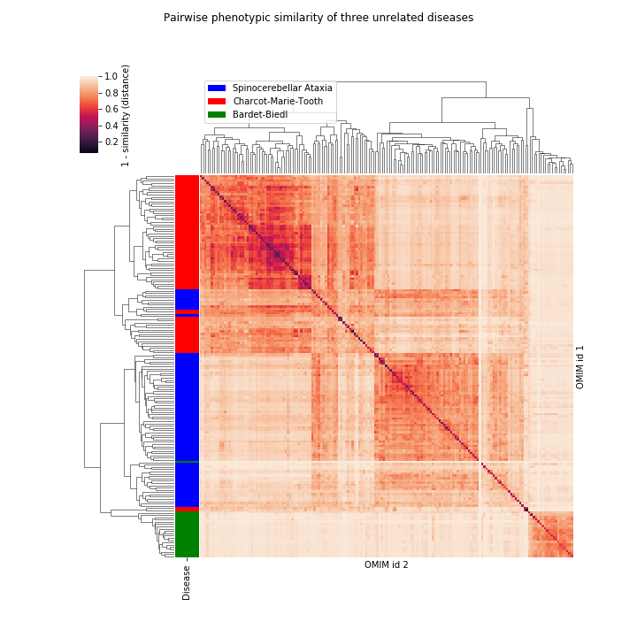

[](https://www.python.org/downloads/release/python-360/)

# Phenosim
`phenosim` is a Python package to perform phenotype similarity scoring by semantic similarity. `phenosim` is a 
lightweight but highly optimized command line tool and library to efficiently perform semantic similarity scoring on 
generic entities with phenotype annotations from the [Human Phenotype Ontology (HPO)](https://hpo.jax.org/app/).



## Installation
### GitHub
Install from GitHub:
```bash
git clone https://github.com/GeneDx/phenosim.git
cd phenosim
python setup.py install
```

## Command Line Usage
### Initial setup
Phenosim is designed to run with minimal setup from the user, to run phenosim with default parameters (recommended), skip ahead 
to the [Commands overview](#Commands-overview).  

This section provides details about where phenosim stores data resources and config files. The following occurs when
you run phenosim for the first time.
 1. Phenosim creates a `.phenosim/` directory in your home folder and downloads external resources from HPO into the
  `$HOME/.phenosim/data/` directory.
 2. Phenosim stores a binary version of the HPO as a [networkx](https://networkx.github.io/documentation/stable/reference/classes/multidigraph.html) 
 graph object here: `$HOME/.phenosim/data/hpo_network.pickle`.
 3. Phenosim creates a `$HOME/.phenosim/phenosim.ini` config file where users can set variables for phenosim to use
 at runtime.

### Commands overview
`phenosim` is primarily used as a command line tool. An entity, as described here, is presented as a sample, gene, or 
disease, but could be any concept that warrants annotation of phenotype terms. 

1. Score similarity of an entity defined by the HPO terms from an input file against all the genes in 
`.phenosim/data/phenotype_to_genes.txt`. We provide a test input file in the repo.
    ```bash
    phenosim score tests/data/test.score.txt
    ```
    Output:
    ```
    #query	gene	score
    SAMPLE	NCBI:10000[AKT3]	0.0252
    SAMPLE	NCBI:10002[NR2E3]	0.0148
    SAMPLE	NCBI:100033413[SNORD116-1]	0.0283
    ...
    ```

2. Score similarity of an entity defined by the HPO terms from an input file against a custom list of entities with HPO annotations, referred to as the `--records-file`.
    ```bash
    phenosim score tests/data/test.score.txt --records-file tests/data/test.score-product.txt
    ```
    Output:
    ```
    #query	entity_id	score
    SAMPLE	118200	0.0584
    SAMPLE	118210	0.057
    SAMPLE	118220	0.0563
    ...
    ```

3. Score pairwise similarity of entities defined in the `--records-file`.
    ```bash
    phenosim score-product tests/data/test.score-product.txt --threads 4
    ```
    Output:
    ```
    118200	118200	0.7692
    118200	118300	0.5345
    118200	300905	0.2647
    ...
    ```

## Parameters
For a full list of command arguments use `phenosim [subcommand] --help`:
```bash
phenosim score --help
```
Output:
```
    --records_file=RECORDS_FILE
        One record per line, tab delimited. First column record unique identifier, second column pipe separated list of HPO identifier (HP:0000001).
    --query_name=QUERY_NAME
        Unique identifier for the query file.
    --obo_file=OBO_FILE
        OBO file from https://hpo.jax.org/app/download/ontology.
    --pheno2genes_file=PHENO2GENES_FILE
        Phenotypes to genes from https://hpo.jax.org/app/download/annotation.
    --threads=THREADS
        Number of parallel process to use.
    --agg_score=AGG_SCORE
        The aggregation method to use for summarizing the similarity matrix between two term sets Must be one of {'BMA', 'maximum'}
    --no_parents=NO_PARENTS
        If provided, scoring is done by only using the most informative nodes. All parent nodes are removed.
    --hpo_network_file=HPO_NETWORK_FILE
        If provided, phenosim will try to load a cached hpo_network obejct from file.
    --custom_annotations_file=CUSTOM_ANNOTATIONS_FILE
        A comma-separated list of custom annotation files in the same format as tests/data/test.score-product.txt
    --output_file=OUTPUT_FILE
        filepath where to store the results.  
```
## Library Usage
The `phenosim` library can be used as a `Python` module, allowing more control for advanced users.   

```python
import os
from phenosim import config
from phenosim.obo import restore
from phenosim.score import Scorer

network_file = os.path.join(config.data_directory, 'hpo_network.pickle')

hpo = restore(network_file)
scorer = Scorer(hpo)

terms_a = ['HP:0001882', 'HP:0011839']
terms_b = ['HP:0001263', 'HP:0000252']

print(scorer.score(terms_a, terms_b))
```
Output:
```
0.0005
```

Another example is to use the library to prune parent phenotypes from the `phenotype_to_genes.txt`
```python
import os
from phenosim import config
from phenosim.obo import restore
from phenosim.util import export_pheno2genes_with_no_parents


network_file = os.path.join(config.data_directory, 'hpo_network.pickle')
phenotype_to_genes_file = os.path.join(config.data_directory, 'phenotype_to_genes.txt')
phenotype_to_genes_no_parents_file = os.path.join(config.data_directory, 'phenotype_to_genes_no_parents.txt')

hpo = restore(network_file)
export_pheno2genes_with_no_parents(phenotype_to_genes_file, phenotype_to_genes_no_parents_file, hpo)
```

### Config
While we recommend using the default settings for most users, the config file *can be* modified: `$HOME/.phenosim/phenosim.ini`.

**IMPORTANT NOTE:  
If the config variable `hpo_network_file` is defined, phenosim will try to load this stored version of the HPO and ignore 
the following command-line arguments: `obo_file` and `custom_annotations_file`.**

To run phenosim with different `obo_file` or `custom_annotations_file`: 
Rename or move the HPO network file: `mv $HOME/.phenosim/data/hpo_network.pickle $HOME/.phenosim/data/hpo_network.old.pickle`

To run phenosim with a previously stored version of the HPO network, simply set 
`hpo_network_file = '/path/to/hpo_network.pickle`.  

## Contributing
We welcome contributions from the community. Please follow these steps to setup a local development environment.  
```bash
pipenv install --dev
```

To run tests locally:
```bash
pipenv shell
coverage run --source=. -m unittest discover --start-directory tests/
coverage report -m
```  

## References
The underlying algorithm which determines the semantic similarity for any two HPO terms is based on an implementation of HRSS, [published here](https://www.ncbi.nlm.nih.gov/pubmed/23741529).
